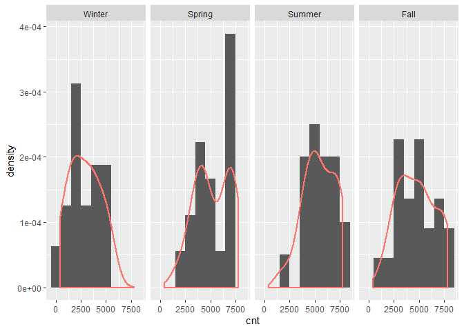
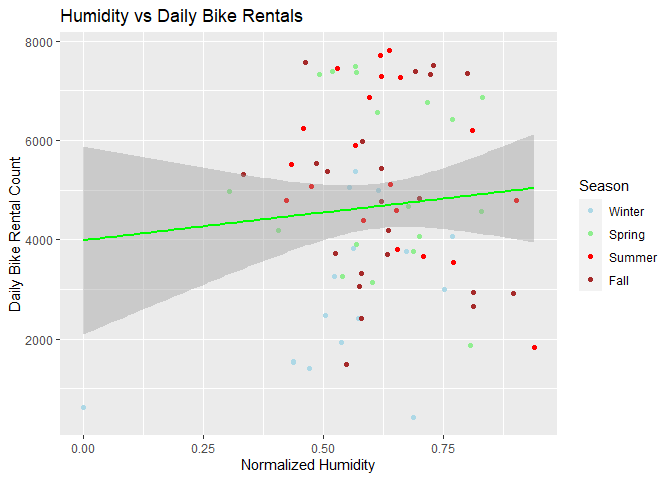
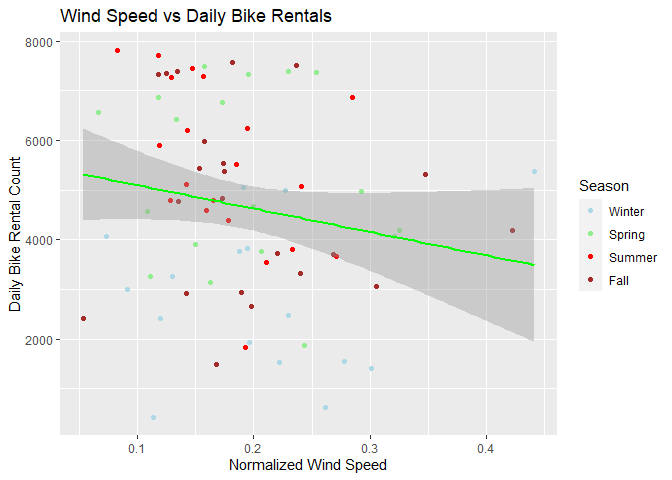
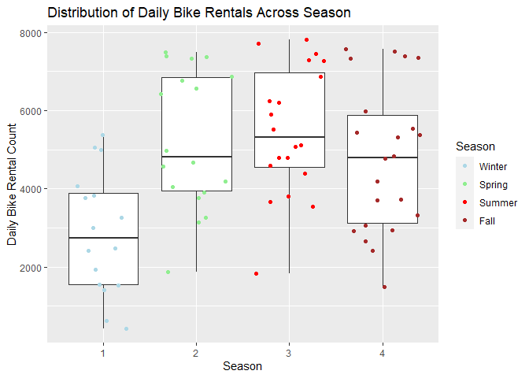
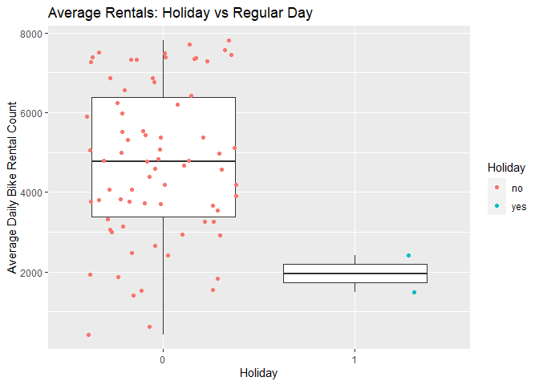
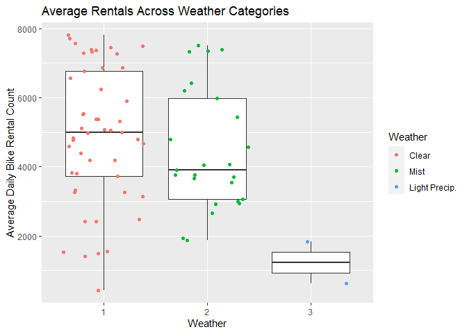
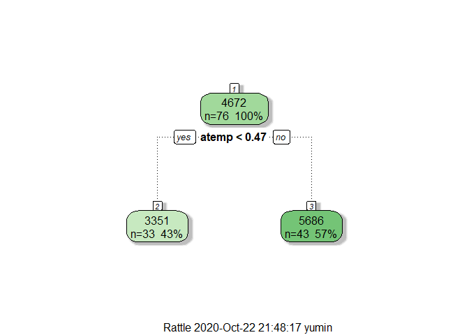

Project 2
================
John Rollman
October 14, 2020

-   [Introduction](#introduction)
    -   [Packages Used](#packages-used)
    -   [Data Pulling and Manipulation](#data-pulling-and-manipulation)
    -   [Data Splitting](#data-splitting)
-   [Exploratory Summary](#exploratory-summary)
    -   [Summary Statistics](#summary-statistics)
    -   [Histogram](#histogram)
    -   [Scatter Plots](#scatter-plots)
    -   [Box Plots](#box-plots)
-   [Model Building](#model-building)
    -   [Tree Based Model (Single)](#tree-based-model-single)
    -   [Boosted Tree Model (Ensemble)](#boosted-tree-model-ensemble)
    -   [Training Performance](#training-performance)
-   [Test Data Performance](#test-data-performance)

Introduction
============

In this project, the objective is to predict the daily bike rental count given a set of inputs. For this analysis, we will be using the \[UCI Bike Sharing Data Set\]<https://archive.ics.uci.edu/ml/datasets/Bike+Sharing+Dataset> . The data set has bike rental data for each day across 2011 and 2012. Attributes about the day were also collected to be used in the moddel such as the season, whether the day was a holiday/working day, the weather, the real and 'feeling' temparature, humidity, and windspeed. The models to be constructed are a single regression tree and then moving to the more complex boosted regression tree.

Packages Used
-------------

``` r
library(tidyverse)
library(caret)
library(knitr)
library(gbm)
library(rattle)
```

Data Pulling and Manipulation
-----------------------------

``` r
bikeData.full <- read.csv("day.csv") 
bikeData <- bikeData.full %>% 
  as_tibble() %>% 
  select(!casual & !registered) %>% 
  #filter(weekday==params$weekday)
  filter(weekday==1) ##Add parameter here later
```

Data Splitting
--------------

``` r
set.seed(558)
DataIndex <- createDataPartition(bikeData$cnt, p = .7, list = F)
bikeTrain <- bikeData[DataIndex,-(1:2)] #%>% mutate_at(1:7,factor)
bikeTest <- bikeData[-DataIndex,-(1:2)] #%>% mutate_at(1:7,factor)
```

Exploratory Summary
===================

Summary Statistics
------------------

``` r
kable(as.array(summary(bikeTrain$cnt)), 
      caption = "Summary Statistics of Daily Bike Rentals", 
      digits = 1)
```

| Var1    |    Freq|
|:--------|-------:|
| Min.    |    22.0|
| 1st Qu. |  3303.2|
| Median  |  4360.5|
| Mean    |  4332.4|
| 3rd Qu. |  5890.2|
| Max.    |  7525.0|

Histogram
---------

Below are distributions of the daily number of bike rentals broken out by season.

``` r
season.lab <- c("Winter","Spring", "Summer","Fall")
names(season.lab) <- c("1","2","3","4")
ggplot(bikeTrain, aes(x=cnt)) +
  geom_histogram(binwidth = 1000, aes(y=..density..)) +
  geom_density(show.legend = F, outline.type = "full", lwd=1, aes(color = "blue")) +
  facet_grid(.~season, labeller = labeller(season = season.lab))
```



Scatter Plots
-------------

Below are some basic scatter plots showing the relationship between daily bike rental count and the numeric variables `Temperature`, `Feeling Temperature`, `Humidity`, and `Wind Speed`. The points are colored based on the season. A simple linear regression line with 95% confidence intervals was applied to the graph to illustrate the relationship.

``` r
ggplot(bikeTrain,aes(x=temp,y=cnt)) + 
  geom_point(aes(color = as.factor(season))) +
  geom_smooth(method=lm, col="Green") +
  ggtitle("Temperature vs Daily Bike Rentals") +
  labs(x = "Normalized Temp in C", y = "Daily Bike Rental Count") +
  scale_color_manual(name = "Season", 
                     labels=c("Winter","Spring", "Summer","Fall"), 
                     values=c("light blue", "light green", "red", "brown"))
```


``` r
ggplot(bikeTrain,aes(x=atemp,y=cnt)) + 
  geom_point(aes(color = as.factor(season))) +
  geom_smooth(method=lm, col="Green") +
  ggtitle("'Feeling' Temperature vs Daily Bike Rentals") +
  labs(x = "Normalized 'Feeling' Temp in C", y = "Daily Bike Rental Count") +
  scale_color_manual(name = "Season", 
                     labels=c("Winter","Spring", "Summer","Fall"), 
                     values=c("light blue", "light green", "red", "brown"))
```


``` r
ggplot(bikeTrain,aes(x=hum,y=cnt)) + 
  geom_point(aes(color = as.factor(season))) +
  geom_smooth(method=lm, col="Green") +
  ggtitle("Humidity vs Daily Bike Rentals") +
  labs(x = "Normalized Humidity", y = "Daily Bike Rental Count") +
  scale_color_manual(name = "Season", 
                     labels=c("Winter","Spring", "Summer","Fall"), 
                     values=c("light blue", "light green", "red", "brown"))
```



``` r
ggplot(bikeTrain,aes(x=windspeed,y=cnt)) + 
  geom_point(aes(color = as.factor(season))) +
  geom_smooth(method=lm, col="Green") +
  ggtitle("Wind Speed vs Daily Bike Rentals") +
  labs(x = "Normalized Wind Speed", y = "Daily Bike Rental Count") +
  scale_color_manual(name = "Season", 
                     labels=c("Winter","Spring", "Summer","Fall"), 
                     values=c("light blue", "light green", "red", "brown"))
```



Box Plots
---------

Below are box plots showing the spread of daily bike rental counts across the factor variables `season`, `holiday`, and `weathersit`.

``` r
ggplot(bikeTrain, aes(x = as.factor(season), y = cnt)) +
  geom_boxplot() +
  geom_jitter(aes(color = as.factor(season))) +
  scale_color_manual(name = "Season", 
                     labels=c("Winter","Spring", "Summer","Fall"), 
                     values=c("light blue", "light green", "red", "brown")) +
  ggtitle("Distribution of Daily Bike Rentals Across Season") +
  labs(x = "Season", y = "Daily Bike Rental Count")
```



``` r
ggplot(bikeTrain, aes(x = as.factor(holiday), y = cnt)) +
  geom_boxplot() +
  geom_jitter(aes(color = as.factor(holiday))) +
  scale_color_discrete(name = "Holiday", labels=c("no","yes")) +
  ggtitle("Average Rentals: Holiday vs Regular Day") +
  labs(x = "Holiday", y = "Average Daily Bike Rental Count")
```



``` r
ggplot(bikeTrain, aes(x = as.factor(weathersit), y = cnt)) +
  geom_boxplot() +
  geom_jitter(aes(color = as.factor(weathersit))) +
  scale_color_discrete(name = "Weather", 
                       labels=c("Clear","Mist","Light Precip.", "Heavy Precip.")) +
  ggtitle("Average Rentals Across Weather Categories") +
  labs(x = "Weather", y = "Average Daily Bike Rental Count")
```



Model Building
==============

Tree Based Model (Single)
-------------------------

The first model being built is a single regression tree. The model will use all variables except `weathersit` due to the lack of variance across days. The models training RMSE will be used as the performance measure. Rsquared will be looked at only as a secondary measure. The model has one tuning paramater `Complexity Parameter`. This will be optimized using Leave-One-Out-Cross-Vailidation,`LOOCV`. Since the model is only using one tree, a printout of the decision tree for the best tuned version is below.

``` r
treeFit <- train(cnt ~ season + workingday + temp + atemp + hum + windspeed, 
                  data = bikeTrain,
                  method = "rpart",
                  trControl = trainControl(method = "LOOCV")
                  )
fancyRpartPlot(treeFit$finalModel)
```



``` r
#Model Tree Plot
model1.perf <- treeFit$results[treeFit$results$RMSE==min(treeFit$results$RMSE),2:3]
#RMSE and R2 of best tuned model
rownames(model1.perf) <- "Single Regression Tree Model"
model1.perf
```

    ##                                  RMSE  Rsquared
    ## Single Regression Tree Model 1670.551 0.2410654

Boosted Tree Model (Ensemble)
-----------------------------

The second model will be built using a boosted regression tree. The model will use the same variables as before. As with the first model, RMSE will be our measure of performance, with Rsquared being a secondary measure. The boosted tree model has 2 tuning parameters, `Interaction Depth` and `Number of Trees`. 10-fold cross-validation will be used to select the best tuned model and generate the RMSE. Since the model is an ensemble method, a plot cannot produced.

``` r
boostFit <- train(cnt ~ season + workingday + temp + atemp + hum + windspeed,
                  data = bikeTrain,
                  method = "gbm",
                  trControl = trainControl(method = "cv", number = 10),
                  verbose = FALSE
                  )
model2.perf <- boostFit$results[boostFit$results$RMSE==min(boostFit$results$RMSE),5:6]
#RMSE and R2 of best tuned model
rownames(model2.perf) <- "Boosted Tree Model"
model2.perf
```

    ##                        RMSE  Rsquared
    ## Boosted Tree Model 1283.141 0.5835231

Training Performance
--------------------

From the models above, the boosted tree model performs the best in terms of RMSE as well as Rsquared. Below are the models compared.

``` r
Model.perf <- rbind(model1.perf,model2.perf)
kable(Model.perf, caption = "Model Performance on Training Data", digits = 2)
```

|                              |     RMSE|  Rsquared|
|:-----------------------------|--------:|---------:|
| Single Regression Tree Model |  1670.55|      0.24|
| Boosted Tree Model           |  1283.14|      0.58|

Test Data Performance
=====================

``` r
pred.model.1 <- predict(treeFit,newdata = bikeTest)
pred.perf.1 <- postResample(pred.model.1,bikeTest$cnt)
#pred.perf.1

pred.model.2 <- predict(boostFit,newdata = bikeTest)
pred.perf.2 <- postResample(pred.model.2,bikeTest$cnt)
#pred.perf.2

pred.perf <- rbind(pred.perf.1,pred.perf.2)
rownames(pred.perf) <- c("Single Regression Tree Model", "Boosted Tree Model")
kable(pred.perf[,1:2], caption = "Model Performance on Testing Data", digits = 2)
```

|                              |     RMSE|  Rsquared|
|:-----------------------------|--------:|---------:|
| Single Regression Tree Model |  1034.69|      0.59|
| Boosted Tree Model           |  1136.74|      0.50|

Based on the testing data performance, it looks like the single regression tree would produced better results. This could be due to the stochastic nature of splitting the data set into a test and training set. Further work could be done to make sure both test and training set are equally representative.
